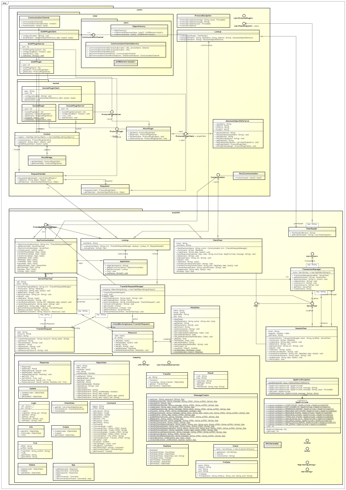
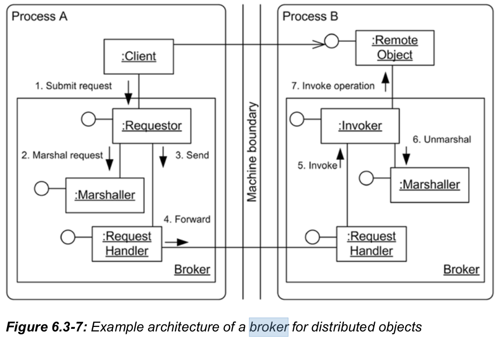

=================
Remoting Patterns
=================

Aufgabenstellung
~~~~~~~~~~~~~~~~

Beschreibung der Applikation
~~~~~~~~~~~~~~~~~~~~~~~~~~~~

Wie Kompilieren?
----------------

Falls noch nicht geschehen, muessen zuerst die Abhaengigkeiten aufgeloest & heruntergeladen werden:

.. code:: bash

    ant get-deps

Anschliessend koennen entweder die tests:

.. code:: bash

    ant test

Nur kompilierung:

.. code:: bash

    ant compile

Oder gleich der ganze Ablauf durchgefuert werden (compile -> test -> package -> jar):

.. code:: bash

    ant

UML
~~~

Verwendete Remoting Patterns
~~~~~~~~~~~~~~~~~~~~~~~~~~~~

Broker Pattern
--------------

Das Hauptpattern dieser Applikation ist das Broker Pattern. [1]_

Der Broker enthält einen Requestor, welche mit hilfe eines Marshaller,
die Anfragen in eine übers Netzwerk übertragbare form bringt. Auf der
Serverseite, wird wieder mit hilfe des Marshaller, die Nachricht in eine
Form gebracht welche vom Invoker genutz werden kann um dass entfernte Objekt
auszurufen. Das Broker Pattern wiederum ist aus besteht aus unterschiedlichen
Patterns zur erfüllung unterschiedlicher Teilaufgaben.

Quelle: Software Architecture,
A Comprehensive Framework and Guide for Practitioners [2]_

Verbesserungsvorschläge, Kritik
~~~~~~~~~~~~~~~~~~~~~~~~~~~~~~~

Testcase schlägt fehl
---------------------

- ant test/ant laeuft nicht durch (debug output wurde hinzugefuegt):

.. code:: bash

    [junit] 70   [main] DEBUG comm.socket.SocketPluginClient  - Got bytes838
    [junit] 70   [main] DEBUG comm.socket.SocketPluginClient  - Read is 838
    [junit] before: Fri Sep 26 09:43:06 CEST 2014
    [junit] after: Fri Sep 26 09:43:06 CEST 2014
    [junit] between: Fri Sep 26 09:43:06 CEST 2014
    [junit] ------------- ---------------- ---------------
    [junit]
    [junit] Testcase: generalTest took 0,21 sec
    [junit]     FAILED
    [junit]
    [junit] junit.framework.AssertionFailedError:
    [junit]     at evs2009.ApplicationTest.check(ApplicationTest.java:91)
    [junit]     at evs2009.ApplicationTest.generalTest(ApplicationTest.java:33)
    [junit]

  Temp. Fix: Auskommentieren von check(..) in den Zeilen 33, 45, 47 in der Datei ApplicationTest.java.

Dokumentation unvollständig gelöscht
------------------------------------

Die Dokumentations-Files welche wohl hätte von uns verborgen werden sollen
waren noch über die Git-History auffindbar. Mit den folgenden Befehl wären die
Dateien tatsächlich vollständig gelöscht worden:

.. code:: bash

    git filter-branch \
    --index-filter 'git rm --cached --ignore-unmatch \
    README \
    documentation/evs028.odt \
    documentation/evs028.pdf \
    documentation/evsCore.jpg \
    documentation/pkgComm.jpg \
    documentation/pkgMapping.jpg \
    ' d0f074f4a20f6b8b68c0ee80b1646e992d8c09ac..HEAD

``d0f074f4a20f6b8b68c0ee80b1646e992d8c09ac`` ist hierbei der erste commit.

Zeitaufzeichnung
~~~~~~~~~~~~~~~~

================================= ================= ========== ===== ===== =========
Task                              Who               Date       From  To    Duration
================================= ================= ========== ===== ===== =========
understanding buildfile           Jakob Klepp       2014-09-26 08:10 09:00   00:50
understanding buildfile           Andreas Willinger 2014-09-26 08:10 09:00   00:50
UML erstellt                      Jakob Klepp       2014-09-26 09:00 10:40   01:40
Kritik: Dokument löschen          Jakob Klepp       2014-09-26 10:40 10:50   00:10
**TOTAL**                                                                  **03:30**
================================= ================= ========== ===== ===== =========

Quellen
~~~~~~~

.. _1:

[1]  Communication Framework,
     184.153 Design Methods for Distributed Systems,
     Version 1.0,
     Michael Borko; Michael Greifeneder; Florian Mitlik,
     Technische Universität Wien

.. _2:

[2]  Software Architecture,
     A Comprehensive Framework and Guide for Practitioners,
     Oliver Vogel; Ingo Arnold; Arif Chughtai; Timo Kehrer,
     ISBN: 978-3-642-19735-2 (Print) 978-3-642-19736-9 (Online),
     http://link.springer.com/book/10.1007/978-3-642-19736-9

.. header::

    +-------------+--------------------+------------+
    | ###Title### | Andreas Willinger, | 2014-09-26 |
    |             | Jakob Klepp        |            |
    +-------------+--------------------+------------+

.. footer::

    ###Page### / ###Total###
